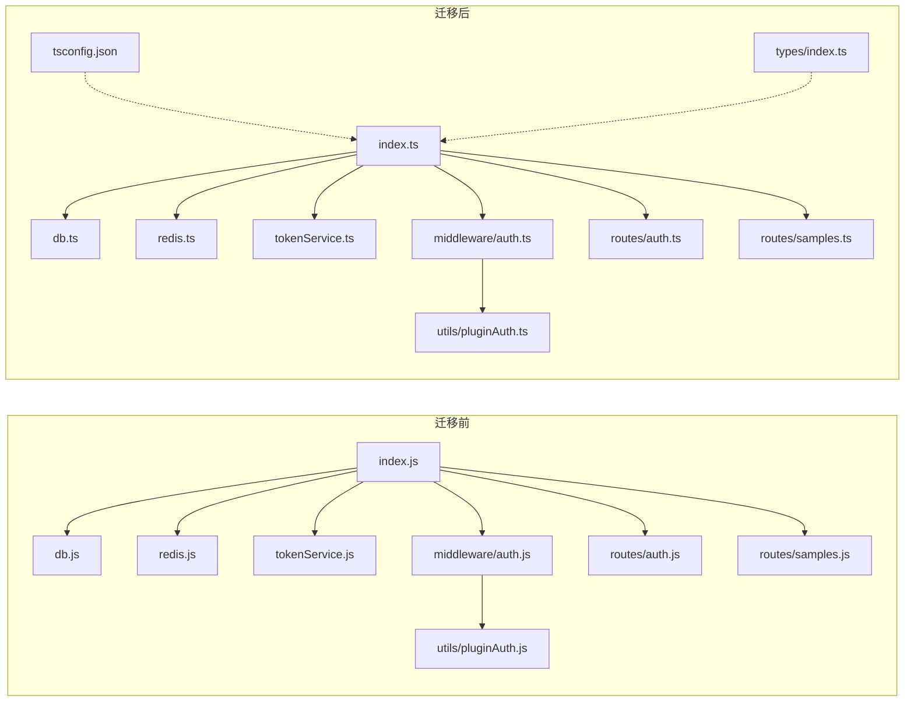
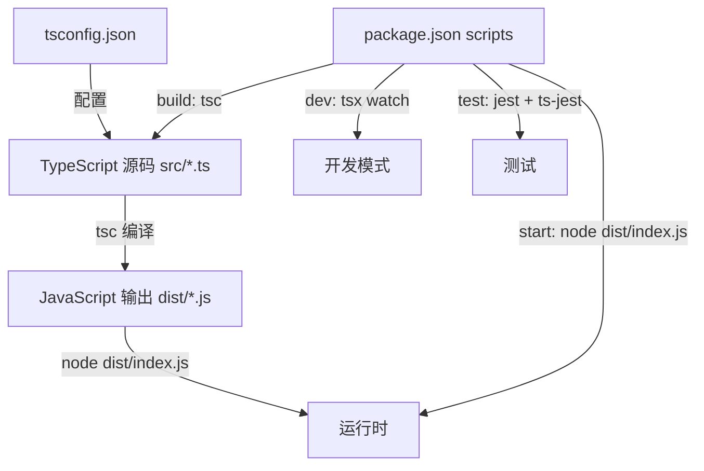
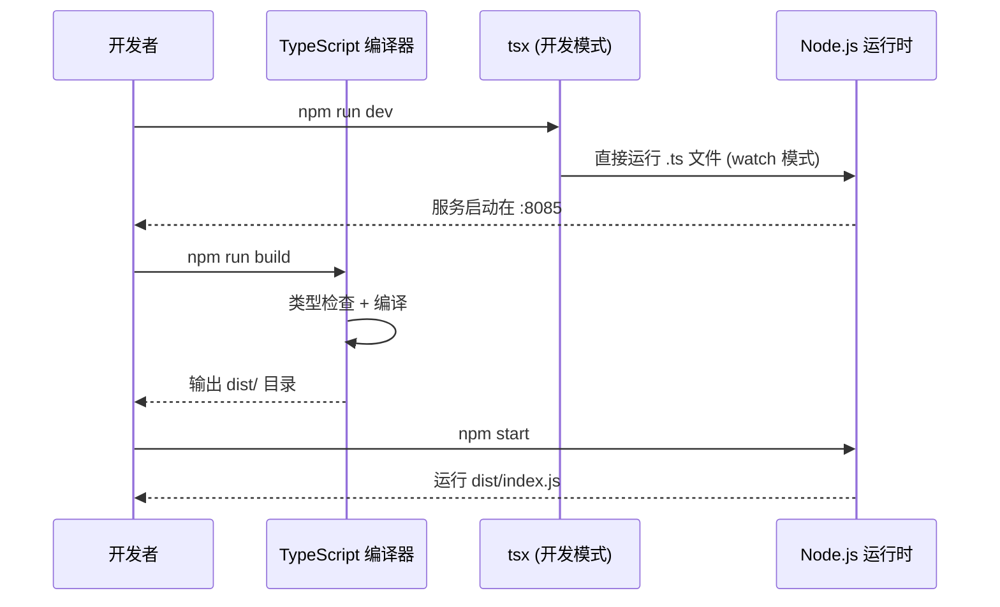
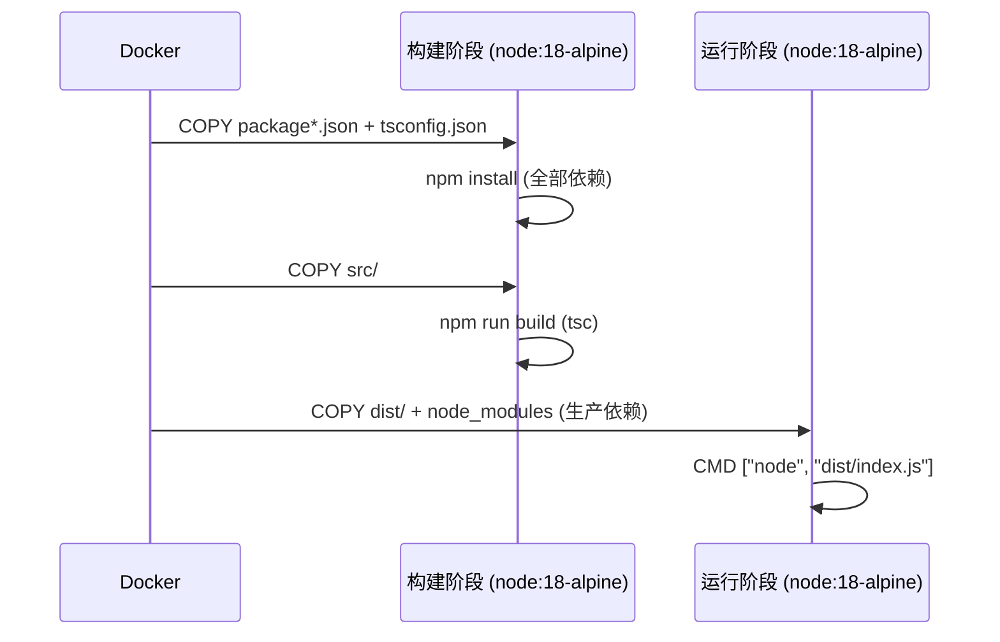

# 设计文档：后端 TypeScript 迁移

## 概述

将后端项目从 JavaScript 迁移到 TypeScript，涵盖所有源文件（`src/` 下的 `.js` → `.ts`）、测试文件（`__tests__/` 下的 `.js` → `.test.ts`）、构建工具链（新增 `tsconfig.json`、更新 `package.json` 脚本和依赖）、Docker 配置（多阶段构建）以及项目文档（`docs/` 目录下所有涉及后端的描述）。

迁移目标是为现有代码添加严格的类型定义，提升代码可维护性和开发体验，同时保持运行时行为完全不变。前端已经是 TypeScript 项目，迁移后前后端技术栈将统一。

迁移采用渐进式策略：先搭建 TypeScript 工具链，再逐模块转换源文件，最后更新测试、Docker 和文档。

## 架构

### 迁移前后对比



### 构建流程



## 主要工作流序列图

### 开发流程



### Docker 构建流程



## 组件和接口

### 组件 1：类型定义模块 (`src/types/index.ts`)

**职责**：集中定义项目中所有共享的 TypeScript 类型和接口。

```typescript
import { Request, Response, NextFunction } from 'express';

// ========== 用户与认证 ==========

export interface User {
  id: number;
  username: string;
  nickname: string;
  roles: string[];
}

export interface AuthenticatedRequest extends Request {
  user: User;
}

// ========== API 响应 ==========

export interface ApiResponse<T = unknown> {
  code: number;
  data?: T;
  message?: string;
}

export interface PaginatedResult<T> {
  data: T[];
  pagination: {
    page: number;
    pageSize: number;
    total: number;
    totalPages: number;
  };
}

// ========== Token 服务 ==========

export interface TokenMetadata {
  userId: string;
  createdAt: string;
  expiresAt: string;
}

// ========== 数据模型 ==========

export interface Sample {
  id: number;
  name: string;
  description: string;
  status: number;
  created_by: number;
  created_at: Date;
  updated_at: Date;
}

export interface CreateSampleBody {
  name: string;
  description?: string;
  status?: number;
}

export interface UpdateSampleBody {
  name?: string;
  description?: string;
  status?: number;
}

export interface ValidationResult {
  valid: boolean;
  error?: string;
}

// ========== 健康检查 ==========

export interface HealthStatus {
  status: 'ok' | 'error';
  version: string;
  db?: string;
  redis?: string;
  message?: string;
}
```

### 组件 2：数据库模块 (`src/db.ts`)

**职责**：创建并导出 MySQL 连接池，提供类型安全的数据库访问。

```typescript
import mysql, { Pool } from 'mysql2/promise';

export const pool: Pool;
```

### 组件 3：Redis 模块 (`src/redis.ts`)

**职责**：创建并导出 Redis 客户端实例。

```typescript
import Redis from 'ioredis';

const redis: Redis;
export default redis;
```

### 组件 4：Token 服务 (`src/tokenService.ts`)

**职责**：Refresh token 的生成、验证、轮换和撤销。

```typescript
export function hashToken(token: string): string;
export function generateRefreshToken(userId: string): Promise<string>;
export function verifyRefreshToken(token: string): Promise<string | null>;
export function rotateRefreshToken(oldToken: string, userId: string): Promise<string>;
export function isTokenUsed(token: string): Promise<boolean>;
export function getUserIdFromUsedToken(token: string): Promise<string | null>;
export function revokeAllUserTokens(userId: string): Promise<void>;
```

### 组件 5：Plugin Auth 客户端 (`src/utils/pluginAuth.ts`)

**职责**：封装对主后端 Plugin Auth API 的调用。

```typescript
export function verifyToken(authHeader: string): Promise<User>;
export function checkPermission(authHeader: string, action: string): Promise<boolean>;
export function getAllowedActions(authHeader: string): Promise<string[]>;
```

### 组件 6：认证中间件 (`src/middleware/auth.ts`)

**职责**：Express 中间件，验证 JWT Token 并注入用户信息。

```typescript
import { Response, NextFunction } from 'express';
import { AuthenticatedRequest } from '../types';

export function ensureRefreshToken(userId: string, res: Response): Promise<void>;
export function auth(req: AuthenticatedRequest, res: Response, next: NextFunction): Promise<void>;
```

### 组件 7：路由模块 (`src/routes/auth.ts`, `src/routes/samples.ts`)

**职责**：定义 Express 路由，处理 HTTP 请求。

```typescript
import { Router } from 'express';

// auth.ts
const router: Router;
export default router;

// samples.ts
const router: Router;
export default router;
```

## 数据模型

### 模型 1：Express 扩展类型

```typescript
// 扩展 Express Request 以包含认证用户信息
export interface AuthenticatedRequest extends Request {
  user: User;
}
```

**说明**：所有需要认证的路由处理函数中，`req` 参数应使用 `AuthenticatedRequest` 类型，确保 `req.user` 的类型安全。

### 模型 2：环境变量类型

```typescript
// 可选：通过 declare 扩展 process.env 类型
declare global {
  namespace NodeJS {
    interface ProcessEnv {
      PORT?: string;
      DB_HOST?: string;
      DB_PORT?: string;
      DB_NAME?: string;
      DB_USER?: string;
      DB_PASSWORD?: string;
      REDIS_HOST?: string;
      REDIS_PORT?: string;
      REDIS_DB?: string;
      MAIN_API_URL?: string;
      PLUGIN_NAME?: string;
      REFRESH_TOKEN_TTL?: string;
      REFRESH_RATE_LIMIT?: string;
    }
  }
}
```

## 关键函数的形式化规格

### 函数 1：hashToken()

```typescript
function hashToken(token: string): string
```

**前置条件：**
- `token` 是非空字符串

**后置条件：**
- 返回 64 字符的十六进制字符串（SHA-256 哈希）
- 相同输入始终产生相同输出（纯函数）
- 无副作用

### 函数 2：generateRefreshToken()

```typescript
async function generateRefreshToken(userId: string): Promise<string>
```

**前置条件：**
- `userId` 是非空字符串

**后置条件：**
- 返回 64 字符的十六进制字符串（原始 token）
- Redis 中 `refresh_token:{userId}` 集合包含该 token 的哈希
- Redis 中 `refresh_token_data:{tokenHash}` 包含元数据
- 两个 key 的 TTL 均设置为 `REFRESH_TOKEN_TTL`

### 函数 3：verifyRefreshToken()

```typescript
async function verifyRefreshToken(token: string): Promise<string | null>
```

**前置条件：**
- `token` 参数已提供（可能为 null/undefined）

**后置条件：**
- 若 token 为空/null → 返回 `null`
- 若 token 哈希在 Redis 中无对应数据 → 返回 `null`
- 若 token 已过期 → 返回 `null`
- 若 token 不在用户的有效集合中 → 返回 `null`
- 若以上检查均通过 → 返回 `userId` 字符串
- 无副作用（只读操作）

### 函数 4：rotateRefreshToken()

```typescript
async function rotateRefreshToken(oldToken: string, userId: string): Promise<string>
```

**前置条件：**
- `oldToken` 是有效的原始 token 字符串
- `userId` 是非空字符串

**后置条件：**
- 旧 token 从用户的有效集合中移除
- 旧 token 的哈希被标记为"已使用"（用于重放检测）
- 旧 token 的元数据被删除
- 返回新生成的 token（64 字符十六进制字符串）

### 函数 5：validateSampleBody()

```typescript
function validateSampleBody(body: CreateSampleBody | UpdateSampleBody, isUpdate?: boolean): ValidationResult
```

**前置条件：**
- `body` 是对象
- `isUpdate` 是布尔值（默认 false）

**后置条件：**
- 创建模式（`isUpdate=false`）：`name` 为空时返回 `{ valid: false, error: '名称不能为空' }`
- `name` 长度 < 2 → 返回 `{ valid: false, error: '名称至少需要 2 个字符' }`
- `name` 长度 > 100 → 返回 `{ valid: false, error: '名称不能超过 100 个字符' }`
- `description` 长度 > 500 → 返回 `{ valid: false, error: '描述不能超过 500 个字符' }`
- 所有检查通过 → 返回 `{ valid: true }`

**循环不变量：** 无（无循环）

## 算法伪代码

### Token 刷新算法

```typescript
// POST /api/auth/refresh 的核心逻辑
async function handleRefresh(refreshToken: string): Promise<RefreshResult> {
  // Step 1: 重放攻击检测
  if (await tokenService.isTokenUsed(refreshToken)) {
    const userId = await tokenService.getUserIdFromUsedToken(refreshToken);
    if (userId) await tokenService.revokeAllUserTokens(userId);
    throw new AuthError('检测到异常，请重新登录', 401);
  }

  // Step 2: 验证 token 有效性
  const userId = await tokenService.verifyRefreshToken(refreshToken);
  if (!userId) throw new AuthError('refresh token 无效或已过期', 401);

  // Step 3: 速率限制检查
  if (await checkRateLimit(userId)) {
    throw new AuthError('请求过于频繁', 429);
  }

  // Step 4: 从主后端获取新 access token
  const accessToken = await requestNewAccessToken(userId);

  // Step 5: 轮换 refresh token
  const newRefreshToken = await tokenService.rotateRefreshToken(refreshToken, userId);

  return { accessToken, refreshToken: newRefreshToken };
}
```

**前置条件：**
- `refreshToken` 是非空字符串
- Redis 连接可用
- 主后端 API 可达

**后置条件：**
- 成功时返回新的 accessToken 和 refreshToken
- 旧 refreshToken 已失效
- 重放攻击时撤销该用户所有 token

### 认证中间件算法

```typescript
// auth 中间件的核心逻辑
async function authMiddleware(req: Request, res: Response, next: NextFunction): Promise<void> {
  // Step 1: 提取 Authorization header
  const header = req.headers.authorization;
  if (!header || !header.startsWith('Bearer ')) {
    return respond(res, 401, '未登录，请先在主系统登录');
  }

  // Step 2: 调用主后端验证 token
  const user: User = await verifyToken(header);

  // Step 3: 注入用户信息
  (req as AuthenticatedRequest).user = user;

  // Step 4: 确保用户有 refresh token
  await ensureRefreshToken(String(user.id), res);

  next();
}
```

**前置条件：**
- Express 请求对象包含 headers
- 主后端 Plugin Auth API 可用

**后置条件：**
- 成功时 `req.user` 包含 `{ id, username, nickname, roles }`
- 若用户无 refresh token，响应头中设置 `X-Refresh-Token`
- 失败时返回 401 状态码

## 示例用法

### TypeScript 配置 (tsconfig.json)

```typescript
{
  "compilerOptions": {
    "target": "ES2020",
    "module": "commonjs",
    "lib": ["ES2020"],
    "outDir": "./dist",
    "rootDir": "./src",
    "strict": true,
    "esModuleInterop": true,
    "skipLibCheck": true,
    "forceConsistentCasingInFileNames": true,
    "resolveJsonModule": true,
    "declaration": true,
    "declarationMap": true,
    "sourceMap": true
  },
  "include": ["src/**/*"],
  "exclude": ["node_modules", "dist", "src/__tests__"]
}
```

### 迁移后的模块示例 (db.ts)

```typescript
import 'dotenv/config';
import mysql, { Pool } from 'mysql2/promise';

const pool: Pool = mysql.createPool({
  host: process.env.DB_HOST || 'localhost',
  port: parseInt(process.env.DB_PORT || '3306'),
  database: process.env.DB_NAME || 'bujiaban',
  user: process.env.DB_USER || 'bujiaban',
  password: process.env.DB_PASSWORD || 'testpassword',
  waitForConnections: true,
  connectionLimit: 10,
  queueLimit: 0,
});

pool.getConnection()
  .then((conn) => {
    console.log('[DB] 数据库连接成功');
    conn.release();
  })
  .catch((err: Error) => {
    console.error('[DB] 数据库连接失败:', err.message);
  });

export { pool };
```

### 迁移后的路由示例 (routes/samples.ts 片段)

```typescript
import { Router, Response } from 'express';
import { pool } from '../db';
import redis from '../redis';
import { checkPermission } from '../utils/pluginAuth';
import { AuthenticatedRequest, ValidationResult, CreateSampleBody, PaginatedResult, Sample } from '../types';

const router = Router();

function validateSampleBody(body: CreateSampleBody, isUpdate = false): ValidationResult {
  const { name, description } = body;
  if (!isUpdate && (name === undefined || name === null)) {
    return { valid: false, error: '名称不能为空' };
  }
  // ... 其余验证逻辑
  return { valid: true };
}

router.get('/', requirePermission('view-sample'), async (req: AuthenticatedRequest, res: Response) => {
  const page = Math.max(1, parseInt(req.query.page as string) || 1);
  // ... 类型安全的查询逻辑
});

export default router;
```

### Jest 配置 (jest.config.ts)

```typescript
import type { Config } from 'jest';

const config: Config = {
  preset: 'ts-jest',
  testEnvironment: 'node',
  roots: ['<rootDir>/src'],
  testMatch: ['**/__tests__/**/*.test.ts'],
  moduleFileExtensions: ['ts', 'js', 'json'],
};

export default config;
```

### 更新后的 package.json scripts

```json
{
  "scripts": {
    "build": "tsc",
    "start": "node dist/index.js",
    "dev": "tsx watch src/index.ts",
    "test": "jest",
    "typecheck": "tsc --noEmit"
  }
}
```

## 正确性属性

1. **类型安全**：所有 `.ts` 文件通过 `tsc --noEmit` 编译无错误
2. **运行时等价**：迁移后的代码在相同输入下产生与原 JS 代码完全相同的输出
3. **测试通过**：所有现有测试用例在迁移后仍然通过
4. **无 any 泄漏**：除第三方库类型不完整的情况外，不使用 `any` 类型
5. **构建产物正确**：`npm run build` 生成的 `dist/` 目录结构与原 `src/` 对应
6. **Docker 构建成功**：更新后的 Dockerfile 能成功构建并运行

## 错误处理

### 场景 1：第三方库缺少类型定义

**条件**：某些 npm 包没有内置类型或 `@types/*` 包
**应对**：在 `src/types/` 中创建 `.d.ts` 声明文件，或在 `tsconfig.json` 中临时使用 `skipLibCheck`
**恢复**：后续补充完整类型定义

### 场景 2：CommonJS 与 ESM 互操作

**条件**：部分库使用 `module.exports`，TypeScript 中 `import` 可能不兼容
**应对**：启用 `esModuleInterop: true`，使用 `import x from 'lib'` 语法
**恢复**：无需额外操作，`esModuleInterop` 处理兼容性

### 场景 3：Express 类型扩展

**条件**：`req.user` 不在 Express 默认类型中
**应对**：定义 `AuthenticatedRequest` 接口扩展 `Request`，在路由处理函数中使用类型断言
**恢复**：无需额外操作

## 测试策略

### 单元测试

- 将所有 `__tests__/*.test.js` 重命名为 `*.test.ts`
- 使用 `ts-jest` 预设，支持在测试中直接使用 TypeScript
- Mock 模块路径从 `../redis` 等保持不变（ts-jest 自动解析）
- 为 mock 对象添加类型注解

### 类型检查测试

- 在 CI 中添加 `npm run typecheck` 步骤
- 确保 `strict: true` 模式下无类型错误

### 集成测试

- 使用 `supertest` 测试 API 端点（与现有测试一致）
- 确保 Docker 构建后的镜像能正常启动和响应健康检查

## 性能考虑

- 开发模式使用 `tsx`（基于 esbuild），启动速度极快，无需等待 tsc 编译
- 生产模式先 `tsc` 编译为 JS，运行时无额外开销
- Docker 镜像使用多阶段构建，最终镜像不包含 TypeScript 编译器和 devDependencies

## 安全考虑

- 迁移不改变任何运行时安全逻辑（token 验证、权限检查、速率限制等）
- TypeScript 的类型系统在编译期捕获潜在的类型错误，减少运行时异常
- `strict: true` 模式强制 null 检查，减少空指针相关的安全问题

## 依赖变更

### 新增 devDependencies

| 包名 | 用途 |
|------|------|
| `typescript` | TypeScript 编译器 |
| `tsx` | 开发模式直接运行 .ts 文件 |
| `ts-jest` | Jest 的 TypeScript 支持 |
| `@types/node` | Node.js 类型定义 |
| `@types/express` | Express 类型定义 |
| `@types/cors` | cors 中间件类型定义 |
| `@types/jsonwebtoken` | jsonwebtoken 类型定义 |
| `@types/jest` | Jest 类型定义 |
| `@types/supertest` | supertest 类型定义 |

### 无需类型包的依赖

| 包名 | 原因 |
|------|------|
| `axios` | 内置 TypeScript 类型 |
| `ioredis` | 内置 TypeScript 类型 |
| `mysql2` | 内置 TypeScript 类型 |
| `dotenv` | 内置 TypeScript 类型 |

## 文档更新范围

以下文档需要更新以反映 TypeScript 迁移：

| 文档 | 更新内容 |
|------|---------|
| `docs/CONTRIBUTING.md` | 后端代码规范从 "JavaScript + Express" 改为 "TypeScript + Express"，更新代码示例 |
| `docs/QUICK_START.md` | 更新后端启动命令、构建命令、Docker 说明 |
| `docs/STRUCTURE.md` | 更新后端目录结构（`.js` → `.ts`，新增 `types/`、`tsconfig.json`、`dist/`） |
| `docs/TESTING-I18N.md` | 无需更新（仅涉及前端） |
| `docs/I18N.md` | 无需更新（仅涉及前端） |
